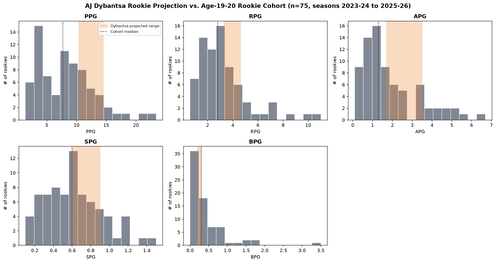

# AJ Dybantsa NBA Rookie Projection

## Project Overview

This project uses recent NBA rookie data to estimate AJ Dybantsa's potential statistical production during his rookie season.

Rather than attempting to predict his NBA production from college statistics alone, I built an age-cohort percentile model using NBA players who entered the league at a similar age. The goal was to create a realistic projection range for Dybantsa while accounting for his expected draft position, college production, and potential NBA role.

The model projects five major rookie statistics:

- Points Per Game (PPG)
- Rebounds Per Game (RPG)
- Assists Per Game (APG)
- Steals Per Game (SPG)
- Blocks Per Game (BPG)

---

## Research Question

**Based on the performance of recent NBA rookies who entered the league at ages 19–20, what could AJ Dybantsa's statistical production look like during his rookie season?**

---

## Dataset

The project uses NBA rookie statistics from three seasons:

- 2023-24
- 2024-25
- 2025-26

The three datasets are combined into one dataset using Pandas.

To create a more meaningful comparison group, I filtered the data to include:

- Rookies aged 19 or 20
- Players who appeared in at least 10 games

This resulted in a comparison cohort of **75 young NBA rookies**.

Players with fewer than 10 games were removed to reduce the impact of extremely small sample sizes.

---

## Methodology

### 1. Data Collection and Cleaning

I loaded each season's rookie statistics into Pandas and combined them into one DataFrame.

The cleaning process included:

- Standardizing per-game statistic column names
- Converting age values to numeric data
- Removing rows with missing player, age, or game information
- Removing extremely small samples
- Combining all three NBA seasons

### 2. Creating the Comparison Cohort

Since Dybantsa is expected to enter the NBA at a young age, I created a comparison group consisting specifically of NBA rookies who were **19 or 20 years old**.

This makes the comparison more relevant than comparing him against rookies of all ages.

### 3. Percentile-Based Projection

Instead of predicting one exact number, the model produces a **projection range**.

Dybantsa is assigned different percentile ranges for each statistic based on his expected strengths, draft profile, college production, and projected NBA opportunity.

| Statistic | Percentile Range |
|-----------|-----------------|
| PPG | 75th–92nd |
| RPG | 65th–85th |
| APG | 60th–85th |
| SPG | 55th–80th |
| BPG | 40th–65th |

Scoring receives the strongest percentile range because it is expected to be one of Dybantsa's most translatable skills.

Blocks receive a more conservative range because shot blocking has not been a major part of his statistical profile.

---

## Projected Rookie Statistics

| Statistic | Projected Range | Cohort Median | Cohort Maximum |
|-----------|----------------|---------------|----------------|
| PPG | **10.4–14.5** | 7.7 | 23.4 |
| RPG | **3.3–4.6** | 2.8 | 11.0 |
| APG | **1.7–3.5** | 1.3 | 6.7 |
| SPG | **0.6–0.9** | 0.6 | 1.5 |
| BPG | **0.2–0.3** | 0.3 | 3.5 |

The model projects Dybantsa above the cohort median in scoring, rebounding, and assists.

His largest projected advantage is scoring, with a range of **10.4 to 14.5 PPG** compared with the cohort median of **7.7 PPG**.

---

## Visualization



The visualization compares Dybantsa's projected statistical ranges with the distribution of the 75-player age 19–20 rookie cohort.

- **Gray histogram:** Distribution of rookie performances
- **Orange shaded area:** Dybantsa's projected range
- **Dashed line:** Cohort median

This makes it easier to see where Dybantsa's projected production falls relative to other young NBA rookies.

---

## Technologies Used

- **Python**
- **Pandas**
- **NumPy**
- **Matplotlib**

---

## Project Structure

```text
AJ-Dybantsa-Rookie-Projection/
│
├── nbaproj.py
├── rookieStats_23-24.csv
├── rookieStats_24-25.csv
├── rookieStats_25-26.csv
├── dybantsa_projection_summary_v2.csv
├── dybantsa_projection_v2.png
└── README.md
